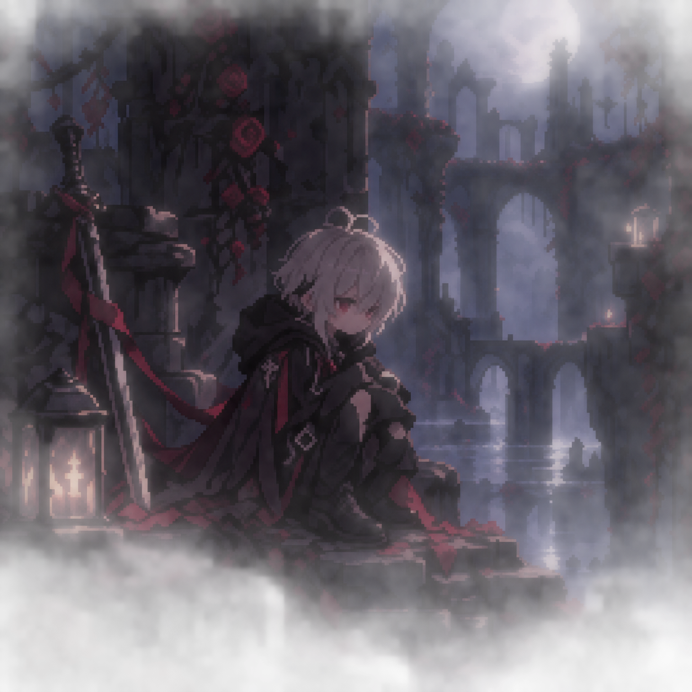
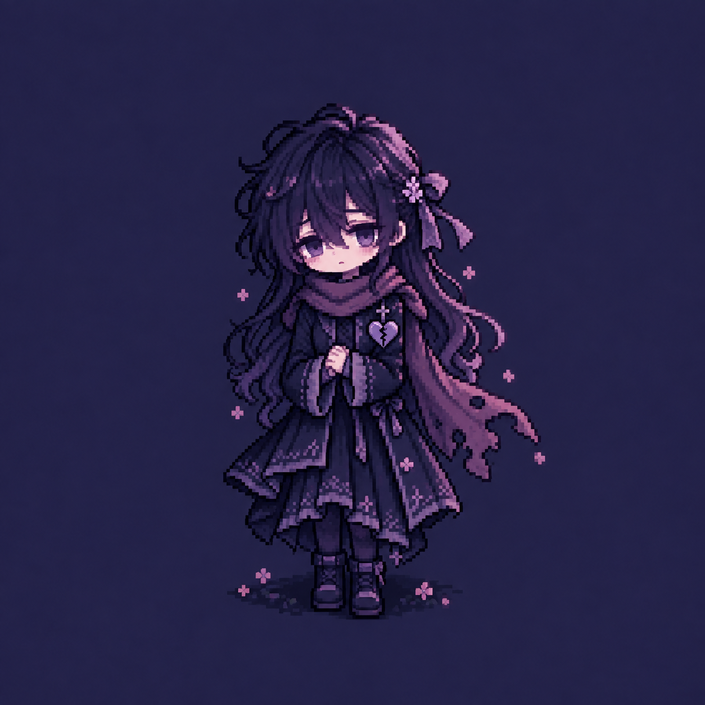
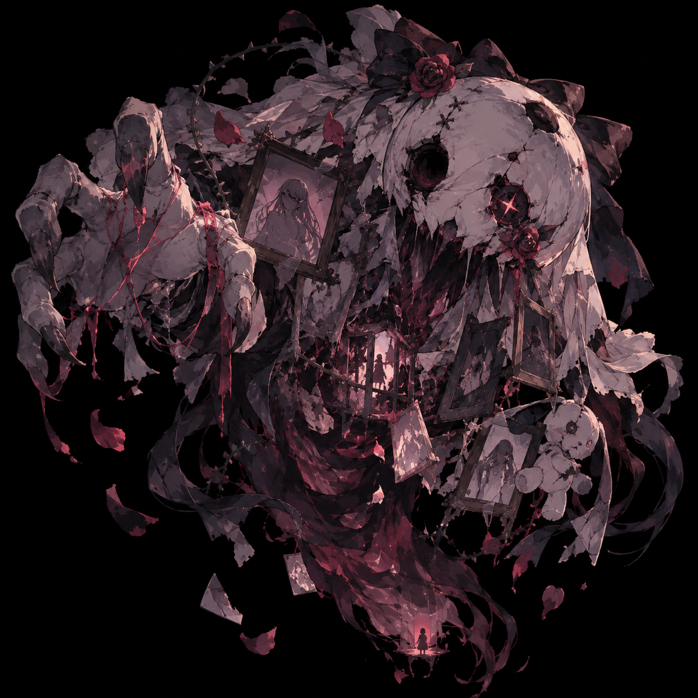
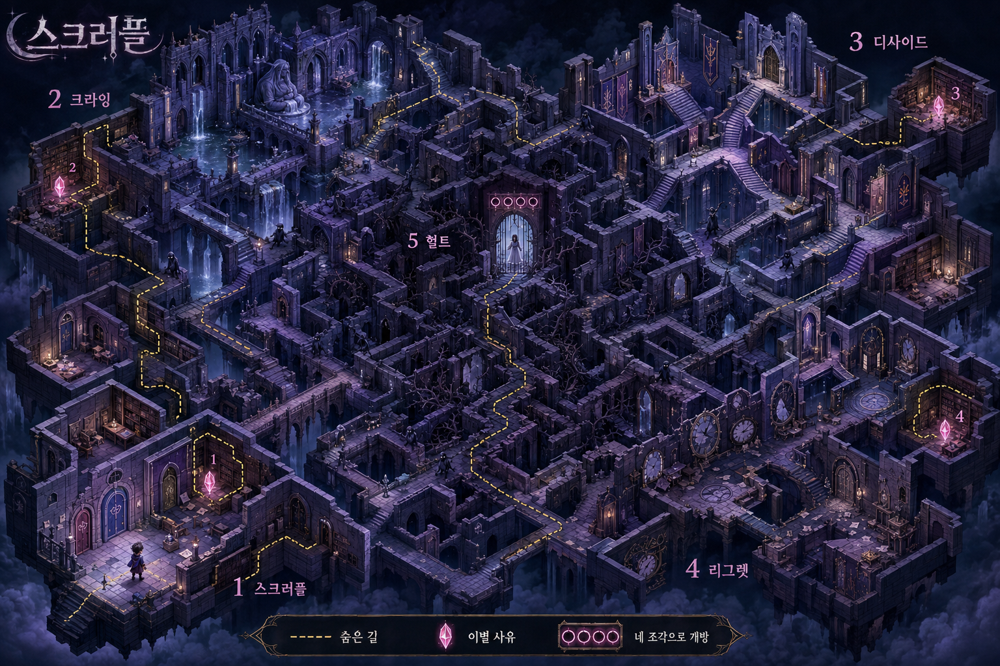
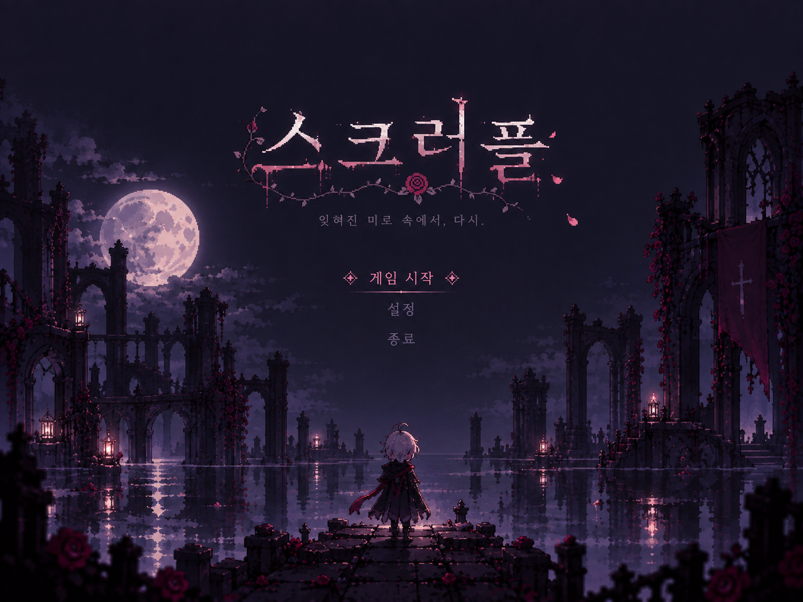
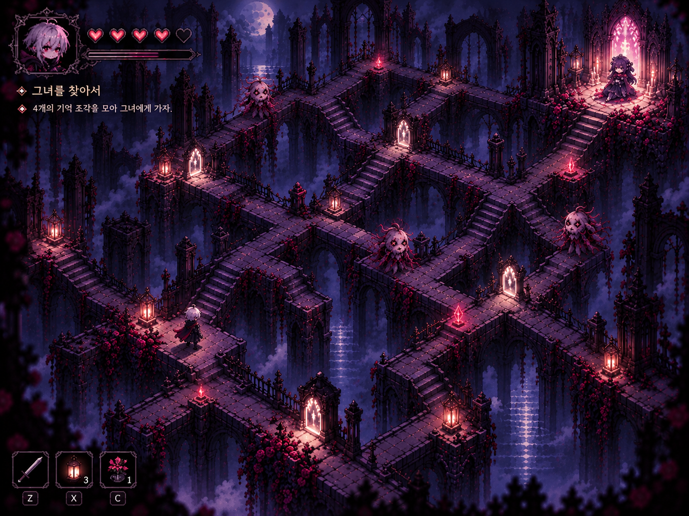
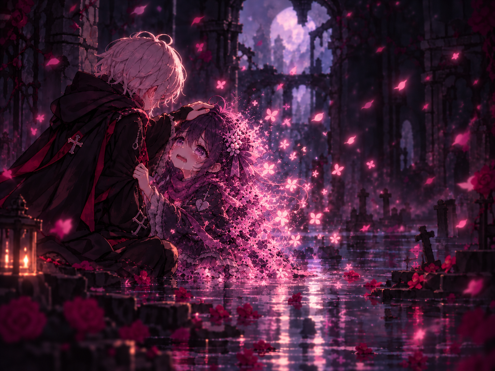

# GameProject

작성자: 26031033_하석현_객체지향프로그래밍_게임제작

작성일: 09/01

업데이트: ---------

게임제목: 스크러플

# 게임 개요
 - 남자주인공인 플레이어가 꿈에서 헤어진 그녀를 찾아다닌다.
 - 후회섞인 미로 속에서 그녀를 찾으면 포옹하며 꿈에서 깨어난다.
 
 #승리 조건
 - 미로 속에서 4개 중 4개의 이별 사유를 찾아 그녀를 찾아 안아주면 게임 클리어한다.
 
 #패배 조건
 - 미로 속에서 4개 미만의 이별 사유를 찾고 그녀를 찾으면 악몽에 잠식된다.
 - 꿈 속의 후회괴물에게 잡히면 악몽에 잠식된다.
 
# 게임 소개
- 꿈 속에서 이해되지 않는 이별 사유 조각들을 모두 모으고 그녀와 만남으로써 비로소 현실을 자각한다.
이 과정에서 유저는 이 둘의 서사를 이해하게 되는 스토리 진행형 게임이다.

# 조작 방법
- WASD 이동
- 상하좌우 막혀있는 길 이외에 자유로이 이동할 수 있다.

# 핵심 시스템
1. 미로
- 4스테이지의 미로에서 이별 사유를 찾아 마지막 5스테이지에서 그녀를 찾는다.
- 스테이지별 미로 구성은 각각 설계하고, 설계된 미로에 후회괴물이라는 장애물을 피해 이별 사유를 찾아 다음 스테이지로 탈출한다.

2. 후회괴물
- 각각의 스테이지에는 후회괴물이 배치되어 있다.
- 규칙적으로 움직이는 경로가 있다. 단, 일정거리에서 플레이어를 발견한다면 일정거리를 벗어나기 전까지 쫓아온다.

3. 게임 루프 및 사용자 입력
- WASD를 확인하여 다음 이동 방향을 결정한다.
- 후회괴물에게 잡아먹히거나 이별 사유를 다 모으지 못하고 그녀를 찾는다면 그녀에게 잠식된다.

# 게임 캐릭터 및 맵

## 1. 주인공

- 꿈속의 미로를 헤매며 헤어진 여자친구를 찾아가는 플레이어 캐릭터이다.
- 어두운 분위기의 복장과 붉은색 포인트를 사용해 게임 전체의 분위기와 어울리도록 디자인하였다.
- 플레이어는 WASD를 이용해 미로를 이동하며 이별의 기억 조각을 수집한다.

## 2. 여자친구

- 미로의 마지막에서 주인공을 기다리고 있는 인물이다.
- 주인공과는 다른 보라색 계열의 색상과 부드러운 이미지로 디자인하였다.
- 주인공을 기다리고 있지만 이미 이별을 어느 정도 받아들인 듯한 모습을 표현하였다.

## 3. 후회괴물

- 주인공이 과거의 이별에서 느끼는 후회와 미련이 형상화된 존재이다.
- 각각의 스테이지에서 미로를 돌아다니며 플레이어의 진행을 방해한다.
- 일정한 경로를 이동하다 플레이어를 발견하면 추격한다.
- 플레이어가 후회괴물에게 잡히면 게임에 실패한다.

## 4. 스크러플 맵

- 게임의 전체적인 미로 디자인이다.
- 어두운 꿈속이라는 설정에 맞춰 폐허가 된 고딕 건축물과 달빛을 중심으로 구성하였다.
- 플레이어는 복잡하게 연결된 길을 탐색하며 이별의 기억을 찾는다.
- 맵 곳곳에는 후회괴물과 기억 조각이 배치된다.

# 게임 화면

## 1. 게임 시작 화면

- 게임을 실행했을 때 가장 먼저 표시되는 화면이다.
- 어두운 폐허와 달빛을 이용해 게임의 전체적인 분위기를 전달한다.
- 게임 제목인 **스크러플**과 게임 시작 메뉴를 표시한다.

## 2. 게임 플레이 화면

- 실제 게임을 진행하는 화면이다.
- 플레이어는 미로 안에서 후회괴물을 피해 이동한다.
- 맵 곳곳에 있는 기억 조각을 수집하면서 여자친구가 있는 장소를 향해 진행한다.
- 후회괴물은 미로 위의 이동 가능한 길을 따라 움직이며 플레이어를 방해한다.

## 3. 게임 종료 화면

- 모든 이별의 기억을 모으고 여자친구에게 도착했을 때 나타나는 게임 클리어 화면이다.
- 주인공은 마지막으로 여자친구의 머리를 쓰다듬으며 이별을 받아들인다.
- 여자친구는 주인공을 붙잡고 싶어 하지만 점차 빛과 꽃잎처럼 사라진다.
- 게임의 주제인 **'잔혹한 이별을 피해 아름다운 이별로 가는 과정'**을 마지막 장면으로 표현한다.